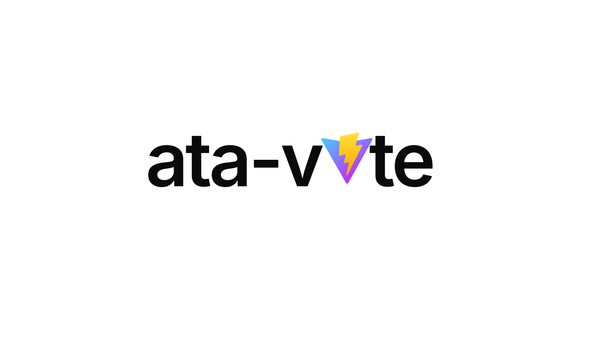

<p align="center">
  
</p>

# ata-vite

Vite plugin that compiles schema files into self-contained [`ata-validator`](https://ata-validator.com) modules plus TypeScript declarations. Build time instead of runtime, ~1 KB gzipped per schema, full type narrowing via `isValid`.

Schemas can be authored as `.json`, `.js`, or `.ts`.

## Install

```bash
npm install --save-dev ata-vite ata-validator
```

`ata-validator` is a peer dependency.

## Quick start

```ts
// vite.config.ts
import { defineConfig } from 'vite'
import ata from 'ata-vite'

export default defineConfig({
  plugins: [
    ata({
      schemas: 'schemas/**/*.json',
      // outDir: 'src/generated',  // optional; defaults to next to each input
    }),
  ],
})
```

For every matched `<name>.json` the plugin writes:

- `<name>.validator.mjs` - self-contained validator, no runtime dependency on `ata-validator`
- `<name>.validator.d.mts` - TypeScript declaration with an `isValid` type predicate

Import from your app:

```ts
import { isValid, validate, type User } from './schemas/user.validator.mjs'

export function handle(input: unknown) {
  if (isValid(input)) {
    // TypeScript narrows `input` to User here
    return { ok: true, id: input.id, role: input.role }
  }
  return { ok: false, errors: validate(input).valid ? [] : validate(input).errors }
}
```

## Schema sources: JSON, JS, TS

Point `schemas` at any mix of `.json`, `.js`, and `.ts` files:

```ts
ata({ schemas: 'schemas/**/*.{json,js,ts}' })
```

JSON stays the default and is read as inert text. JS and TS modules export the
schema as the default export (a named `schema` export also works):

```ts
// schemas/user.ts
export default {
  type: 'object',
  properties: {
    id: { type: 'integer', minimum: 1 },
    role: { type: 'string', enum: ['admin', 'user'] },
  },
  required: ['id'],
} as const
```

On `ata-validator` 0.16.0 or newer you can wrap the object in `defineSchema` for
keyword autocomplete and value checking while authoring, instead of `as const`:

```ts
// schemas/user.ts
import { defineSchema } from 'ata-validator'

export default defineSchema({
  type: 'object',
  properties: { id: { type: 'integer', minimum: 1 } },
  required: ['id'],
})
```

Authoring in JS or TS lets you add comments, share constants across schemas, and
compose with plain code, which JSON cannot do. TS is loaded through
[`jiti`](https://github.com/unjs/jiti) so it works without a separate build step
on every supported Node version. `jiti` ships as a dependency and is loaded only
when a `.ts` file is actually compiled, so JSON- and JS-only projects pay nothing
for it.

A `.ts` schema can import shared fragments through path aliases. Both your
tsconfig `compilerOptions.paths` and your Vite `resolve.alias` entries are
resolved:

```ts
// schemas/user.ts
import { idField } from '#shared/fields'   // tsconfig paths
import { email } from '@/schemas/common'   // vite resolve.alias

export default {
  type: 'object',
  properties: { id: idField, email },
  required: ['id'],
}
```

Aliases apply to `.ts` only. `.js` schemas are loaded by native import, which has
no notion of aliases, so use relative paths there. Vite aliases defined with a
RegExp `find` are skipped, since only string aliases map to the loader.

One thing to know: JS and TS schemas execute at build time, the same as your
`vite.config`. JSON does not run code, so keep using it when a schema is fully
static and untrusted.

## Options

```ts
ata({
  schemas: 'schemas/**/*.json',  // glob or array of globs, relative to Vite root
  outDir: null,                  // null = alongside each input; or a folder like 'src/generated'
  format: 'esm',                 // 'esm' | 'cjs'
  abortEarly: false,             // true = stub errors, smallest output
  types: true,                   // false to skip .d.mts / .d.cts
  nameFromFile: (file) => string // customize the TS type name derived from filename
})
```

### `abortEarly`

Replaces the detailed error collector in the generated validator with a shared stub. Output drops from roughly 1.2 KB gzipped to 0.6 KB gzipped on a typical 10-field schema. Use it when the caller only needs a boolean reject/accept decision.

### `outDir`

By default the output lands next to each input file. Pass a directory to relocate everything to `<outDir>/<mirrored input path>/<base>.validator.*`. Easier to `.gitignore` when you do not want generated files checked in.

### Idempotent writes

If the generated content matches what is already on disk, the file is not rewritten. TypeScript watch and Vite HMR stay quiet during no-op rebuilds.

## Programmatic API

Useful in custom build scripts outside Vite.

```js
import { compile } from 'ata-vite'

await compile({
  schemas: 'schemas/**/*.json',
  outDir: 'src/generated',
  abortEarly: true,
  root: process.cwd(),
})
```

Returns `{ files, results }` where `results[i].changed` indicates whether the output file was actually rewritten.

## What it does under the hood

Each matched schema is compiled via `new Validator(schema).toStandaloneModule(...)` and `toTypeScript(schema, { name })` from `ata-validator`. No subprocess, no CLI wrapper. The plugin hooks:

- `configResolved` - resolve Vite root and logger
- `buildStart` - compile every matched schema
- `handleHotUpdate` - recompile on file change in dev mode
- `watchChange` - same, for rollup-style watch contexts outside a dev server

## License

MIT
